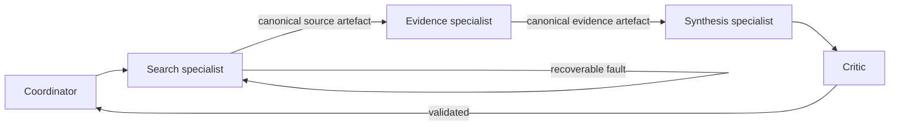

# CrewAI research assistant

## Purpose

This implementation uses a CrewAI Flow with five genuine specialist assignments while retaining the central research task, model interface, fixtures, tools, budgets, safety policy, schemas, checkpoints, traces and evaluator.

## Architecture



The coordinator owns decomposition and termination but has no tool permission. The search specialist can request only `search_catalogue`; the evidence specialist can request only `extract_evidence`; the synthesis specialist receives structured evidence and has no tools; the critic can request only `critique_draft`. CrewAI `Agent` and `Task` objects capture these distinct assignments and expected structured outputs. Canonical Pydantic artefacts—not unrestricted CrewAI chat history—cross each Flow boundary.

## Run

Install the optional framework dependency:

```bash
uv sync --dev --extra crewai --frozen
```

## Expected output

The standard variant produces the same canonical answer, evidence and 4-model/3-tool-call trajectory as the baseline. State, trace, manifest and answer files are written beneath `outputs/runs/<run-id>/`.

Run every deterministic variant:

```bash
uv run python case_study/crewai/run.py --variant standard
uv run python case_study/crewai/run.py --variant insufficient-evidence
uv run python case_study/crewai/run.py --variant clarification-required
uv run python case_study/crewai/run.py --variant tool-failure
```

Interrupt and resume through the shared canonical checkpoint:

```bash
uv run python case_study/crewai/run.py --run-id crew-resume --interrupt-after-steps 2
uv run python case_study/crewai/run.py --run-id crew-resume --resume
```

Run the common evaluator with:

```bash
uv run python case_study/crewai/evaluate.py
```

Strict replay accepts a compatible canonical recording:

```bash
uv run python case_study/crewai/run.py --mode replay --replay-fixture path/to/run.jsonl
```

Optional local inference still crosses only the existing `ModelClient`:

```bash
export AGENTIC_TUTORIAL_LOCAL_MODEL_PATH=models/local/Qwen3-0.6B-Q8_0.gguf
uv run --extra local-llama-cpp python case_study/crewai/run.py --mode local
```

## Concept introduced

CrewAI expresses functional specialist ownership through `Agent`, `Task` and Flow abstractions while exchanging canonical structured artefacts.

## Limitations

CrewAI provides specialist `Agent`/`Task` ownership and sequential Flow events. Automatic manager calls, delegation, memory, caching, planning, retries, framework tools, framework tracing and telemetry are disabled so model and tool counts remain matched. A sentinel CrewAI LLM raises if the framework attempts an unaccounted call; all real calls use the common model client.

Unlike LangGraph, recovery occurs inside the bounded search specialist rather than through a visible graph cycle. Unlike the plain-Python loop, specialist task boundaries and delegation events are explicit. CrewAI 1.15 automatically creates Flow memory unless its internal opt-out used by CrewAI's own internal flows is set; this adapter applies that opt-out and records the difference in manifests. Canonical JSON checkpoints provide durable resumption without repeating successful work.

All current tools are read-only, so approval is not triggered. The shared safety executor still enforces exact-action approval for any consequential tool introduced centrally. Replay requires matching canonical requests. Optional sub-1B models may fail structured specialist actions.

## Next step

Contrast task-oriented orchestration with [SDK handoffs](../openai_agents/README.md), then reproduce the [matched comparison](../../evaluation/comparison/README.md).
