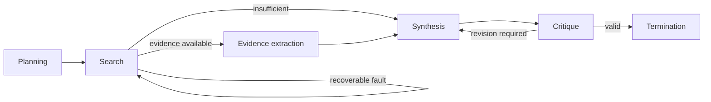

# LangGraph research assistant

## Purpose

This implementation expresses the common research-assistant task as a typed LangGraph graph. It imports the central task specification, prompts, model interface, deterministic fixtures, tools, budgets, safety policy, canonical schemas, checkpoints, traces and evaluator rather than redefining them.

## Architecture



Planning establishes the shared bounded plan. Search and evidence-extraction nodes invoke the corresponding canonical tools. Synthesis is an explicit routing/state boundary and deliberately adds no hidden model call. Critique invokes the shared validation tool; recoverable search or critique failures follow graph cycles. Termination requests the same canonical finish action and assembles the shared `FinalAnswer`.

## Run

Install the optional framework dependency during development:

```bash
uv sync --dev --extra langgraph --frozen
```

Run any deterministic variant:

```bash
uv run python case_study/langgraph/run.py --variant standard
uv run python case_study/langgraph/run.py --variant insufficient-evidence
uv run python case_study/langgraph/run.py --variant clarification-required
uv run python case_study/langgraph/run.py --variant tool-failure
```

Interrupt after a completed canonical step and resume from the durable canonical checkpoint:

```bash
uv run python case_study/langgraph/run.py --run-id graph-resume --interrupt-after-steps 2
uv run python case_study/langgraph/run.py --run-id graph-resume --resume
```

Run the common evaluator with:

```bash
uv run python case_study/langgraph/evaluate.py
```

## Expected output

The standard variant produces the same canonical answer, evidence and 4-model/3-tool-call trajectory as the baseline. State, trace, manifest and answer files are written beneath `outputs/runs/<run-id>/`.

Replay mode accepts a compatible canonical replay fixture:

```bash
uv run python case_study/langgraph/run.py --mode replay --replay-fixture path/to/run.jsonl
```

Optional local inference uses only the existing `ModelClient` adapter:

```bash
export AGENTIC_TUTORIAL_LOCAL_MODEL_PATH=models/local/Qwen3-0.6B-Q8_0.gguf
uv run --extra local-llama-cpp python case_study/langgraph/run.py --mode local
```

## Concept introduced

LangGraph makes phases, conditional routing and recovery cycles explicit as nodes and edges. Its in-memory checkpointer stores native snapshots within an invocation; the canonical JSON checkpoint remains the durable, framework-neutral resume boundary.

## Limitations

Unlike the plain-Python loop, named graph nodes and conditional edges expose phase routing directly. Planning and synthesis are graph transitions, not extra model calls, so offline model/tool call counts remain matched. LangGraph's in-memory checkpointer records native node snapshots during one invocation; canonical JSON checkpoints provide framework-neutral, cross-process recovery. Resumption reconstructs the graph at the next safe node and does not repeat completed tool work.

All case-study tools are read-only, so no approval pause is triggered. They still pass through the shared policy engine, whose exact-action approval enforcement applies unchanged if a consequential tool is introduced centrally. Replay files must match canonical requests exactly. Optional sub-1B local models may not reliably follow structured actions or complete the full workflow.

## Next step

Contrast graph orchestration with [CrewAI specialist tasks](../crewai/README.md), then reproduce the [matched comparison](../../evaluation/comparison/README.md).
