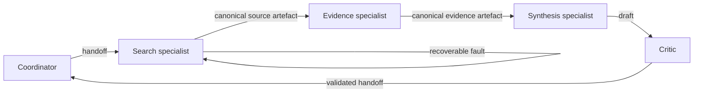

# OpenAI Agents SDK research assistant

This implementation uses OpenAI Agents SDK specialists, function-tool adapters, handoffs, run context and guardrails while retaining the central research task, model interface, fixtures, tools, budgets, safety policy, schemas, checkpoints, traces and evaluator.



The coordinator has no tool permission. Search can access only `search_catalogue`, evidence only `extract_evidence`, synthesis has no tools and produces the `FinalAnswer` shape, and critique can access only `critique_draft`. SDK function tools adapt the canonical definitions; the shared executor remains authoritative for validation, permissions, approval, budgets and trace events. Only canonical Pydantic artefacts cross durable boundaries.

## Run offline

Install the optional framework dependency:

```bash
uv sync --dev --extra openai-agents --frozen
```

Run every deterministic variant:

```bash
uv run python case_study/openai_agents/run.py --variant standard
uv run python case_study/openai_agents/run.py --variant insufficient-evidence
uv run python case_study/openai_agents/run.py --variant clarification-required
uv run python case_study/openai_agents/run.py --variant tool-failure
```

Interrupt and resume through the shared canonical checkpoint:

```bash
uv run python case_study/openai_agents/run.py --run-id sdk-resume --interrupt-after-steps 2
uv run python case_study/openai_agents/run.py --run-id sdk-resume --resume
```

Run the common evaluator with:

```bash
uv run python case_study/openai_agents/evaluate.py
```

Strict replay accepts a compatible canonical recording:

```bash
uv run python case_study/openai_agents/run.py --mode replay --replay-fixture path/to/run.jsonl
```

Optional local inference still crosses only the existing `ModelClient`:

```bash
export AGENTIC_TUTORIAL_LOCAL_MODEL_PATH=models/local/Qwen3-0.6B-Q8_0.gguf
uv run --extra local-llama-cpp python case_study/openai_agents/run.py --mode local
```

## Comparison notes and limitations

SDK `Agent`, `FunctionTool`, `Handoff`, `RunContextWrapper` and guardrail objects express the specialist structure. SDK-hosted tracing is not invoked because the SDK `Runner` is not used; canonical local tracing records every handoff, guardrail, model call, tool call, checkpoint and termination.

The SDK `Runner` is deliberately not used. It owns model turns, message and handoff-history shaping, tool retries and session behaviour; enabling those defaults would create calls and prompts that are absent from the matched plain-Python, LangGraph and CrewAI runs. Instead, SDK handoff callbacks form a bounded explicit orchestration chain, while the common `ModelClient` performs every model call. This preserves strict replay and exact accounting, but it does not demonstrate the SDK's autonomous agent loop or hosted tracing.

Unlike LangGraph, routing is a handoff chain rather than graph edges. Unlike CrewAI, task ownership is represented by handoff targets and tool permissions rather than Flow tasks. Unlike plain Python, specialist boundaries are first-class SDK agents. All current tools are read-only, so approval is not triggered; any centrally introduced consequential action still requires exact scoped approval through the shared safety executor. Optional sub-1B models may fail structured planning or critique.
