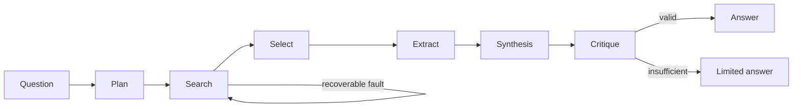

# Plain-Python research assistant

## Purpose

This transparent reference implementation composes the common model interface, validated read-only tools, canonical state, shared budgets, checkpoints, traces and manifests. Its visible flow is plan → search → select → extract → synthesise → critique → terminate. It deliberately uses no agent framework or live provider.

## Architecture



## Run

Run the standard variant from the repository root:

```bash
uv run python case_study/plain_python/run.py --variant standard
```

## Expected output

The expected answer cites `source-001` and `source-002`, explains trajectory checks and offline reproducibility, and states that the synthetic catalogue is not a systematic review.

Other deterministic variants use `insufficient-evidence`, `clarification-required` and `tool-failure`. To demonstrate checkpointing, first run with `--run-id resume-demo --interrupt-after-steps 2`, then repeat with `--run-id resume-demo --resume`.

Generated state, trace, manifest, evaluation and final-answer files are written beneath `outputs/runs/<run-id>/`. Retrieved catalogue content is treated as untrusted; only the three centrally allowed read-only tools can execute, so no approval token or external side effect is required.

## Concept introduced

The baseline makes the complete bounded orchestration visible without framework abstractions. It is the reference against which framework semantics are compared.

## Limitations

The implementation is intentionally explicit and does not provide framework-native graph visualisation, task ownership or handoffs. Mock is the default; replay is strict, the local model is optional and cloud providers are future adapters.

## Next step

Compare alternative orchestration in [LangGraph](../langgraph/README.md), [CrewAI](../crewai/README.md) and the [OpenAI Agents SDK](../openai_agents/README.md).
