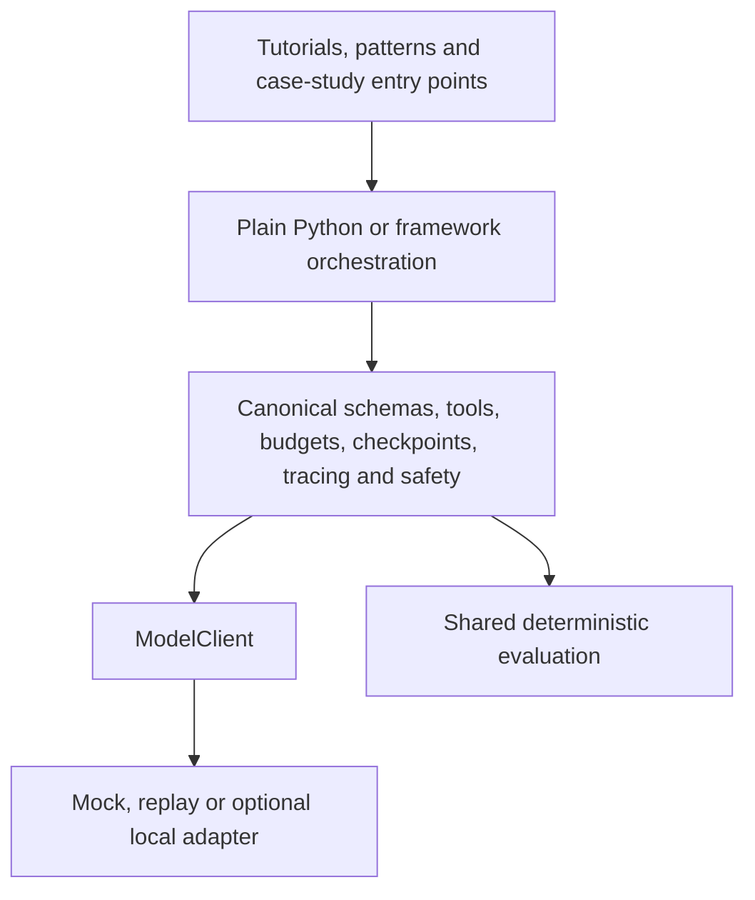

# Repository architecture

The repository separates reusable system components from orchestration expressions so that teaching examples and framework comparisons share one contract.

## Shared layer

`src/agentic_tutorial/` owns canonical Pydantic schemas, the provider-independent `ModelClient`, safe tool execution, budgets, checkpoints, tracing, safety policies, the common case-study specification and evaluation metrics. Provider-specific values are normalised at adapter boundaries.

## Orchestration layer

`frameworks/` contains only reusable LangGraph, CrewAI and OpenAI Agents SDK orchestration. `case_study/<implementation>/` contains runnable entry points, example configuration and documentation. Plain Python is the reference implementation.

The matched comparison disables framework behaviour that would add hidden calls: CrewAI autonomous delegation and memory are disabled, and the OpenAI Agents SDK autonomous Runner is excluded. LangGraph uses native in-memory checkpoints within a graph invocation and canonical JSON checkpoints for durable resumption.

## Teaching and evidence

`tutorials/` introduces components, `patterns/` introduces execution flows, and `notebooks/` composes those existing modules for teaching. `evaluation/` owns matched experiments and small deliberate results; generated runs remain under ignored `outputs/` paths.

No iterative flow is unbounded. Canonical state, traces, checkpoints and final outputs contain no framework-native or provider-native object.
