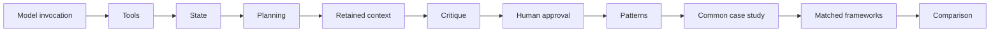

# Learning path

This path separates components, execution patterns and framework abstractions before combining them in one controlled case study.

## 1. System components

System components are the reusable parts of an agentic system: model client, tools, state, context, plans, checkpoints, budgets, safety policies and traces. Work through the [progressive tutorials](../tutorials/README.md), then the [human-approval example](../tutorials/human_approval/README.md).

## 2. Execution patterns

Execution patterns arrange components into recurring control flows such as chaining, routing, tool-use cycles, planner-executor loops and specialist coordination. They are not new providers or schemas. Continue with the [six pattern groups](../patterns/README.md).

## 3. Common case study

The [research-assistant task](../case_study/README.md) combines the components and patterns using one versioned synthetic catalogue, fixed prompts, common tools and deterministic annotations. The [plain-Python baseline](../case_study/plain_python/README.md) is the transparent reference.

## 4. Framework abstractions

[LangGraph](../case_study/langgraph/README.md), [CrewAI](../case_study/crewai/README.md) and the [OpenAI Agents SDK](../case_study/openai_agents/README.md) express the same task through different orchestration abstractions. They do not redefine shared prompts, tools, safety or evaluation.

## 5. Evaluation and comparison

Read the [metric definitions](../evaluation/README.md), then reproduce the [matched comparison](../evaluation/comparison/README.md). Outcome metrics are deterministic; latency and memory remain observational machine-dependent measurements.

## 6. Supplementary notebooks

Use the [teaching notebooks](../notebooks/README.md) to revisit the component sequence, execution flows and matched evidence in a classroom-friendly form. They compose the same package code and are not alternative implementations.

## Execution modes

- **Mock:** default deterministic scripted responses; used by tests and comparison.
- **Replay:** strict canonical request-response playback for regression checks.
- **Local model:** optional real CPU inference using separately downloaded GGUF weights.
- **Cloud provider:** future optional adapter; never required by the learning path.

For deeper reference, see the [repository architecture](architecture.md), [compatibility table](compatibility.md), [reproducibility guide](reproducibility.md) and [release checklist](release_checklist.md).
