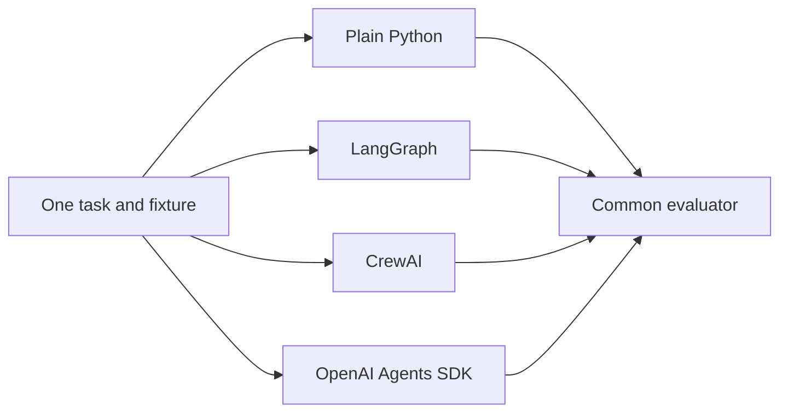

# Matched framework comparison

## Purpose

Compare orchestration properties across plain Python, LangGraph, CrewAI and the OpenAI Agents SDK without changing the common research task or producing a single overall ranking.

## Matched design

Every run uses the standard case-study variant, deterministic mock provider, central prompts, three canonical read-only tools, versioned catalogue, budget, safety policy, stopping rules, schemas and deterministic evaluator. Three repetitions expose variability in observational measurements. Raw state, trace and manifest files remain under `outputs/comparison/runs/`.



## Reproduce

```bash
uv run python evaluation/compare.py --repetitions 3 --output-root outputs/comparison
```

Machine-readable results are written to `result.json` and `summary.csv` beneath the output root. The small recorded snapshot is in [results/result.json](results/result.json), with its [configuration](results/config.json) and [CSV summary](results/summary.csv).

## Results

All four implementations completed the task with valid final answers, evidence precision and recall of `1.00`, tool-selection validity of `1.00`, trajectory validity of `1.00`, four model calls, three tool calls and four canonical steps. Failure recovery is reported as unavailable—not zero—because the matched standard task does not inject a failure.

| Implementation | Framework events | Wall time, s | Python peak, MiB | Import time, s |
|---|---:|---:|---:|---:|
| Plain Python | 0 | 0.480 ± 0.046 | 0.877 ± 0.052 | 0.098 ± 0.031 |
| LangGraph | 9 node decisions | 0.628 ± 0.077 | 1.046 ± 0.130 | 0.459 ± 0.004 |
| CrewAI | 6 delegations | 0.405 ± 0.035 | 1.087 ± 0.066 | 1.370 ± 0.100 |
| OpenAI Agents SDK | 5 handoffs | 0.472 ± 0.019 | 0.825 ± 0.007 | 0.875 ± 0.072 |

Times and memory are descriptive measurements from one macOS/Python 3.11 environment. Python peak is measured with `tracemalloc`; it is not process RSS. They are not deterministic equality criteria and must not be interpreted as framework rankings.

## Implementation-facing measurements

The line count is non-blank, non-comment physical Python lines in the named orchestration file only; it excludes all shared code but includes docstrings and adapter glue. The dependency footprint recursively counts installed distributions reachable from the named project/framework distribution and sums their installed files. Dependencies overlap, so the totals are not additive.

| Implementation | Orchestration lines | Distributions | Installed footprint | Checkpoint/resume |
|---|---:|---:|---:|---|
| Plain Python | 265 | 6 | 6.3 MiB | Verified |
| LangGraph | 698 | 35 | 22.9 MiB | Verified |
| CrewAI | 495 | 129 | 594.9 MiB | Verified |
| OpenAI Agents SDK | 493 | 37 | 26.0 MiB | Verified |

All implementations use the shared exact-action approval policy and canonical checkpoint boundary. The comparison task is read-only, so human approval is supported but not triggered.

## Architectural strengths and limitations

- **Plain Python:** transparent reference orchestration; the application owns every transition and persistence integration.
- **LangGraph:** explicit nodes, edges and recovery cycles; native snapshots are in-memory here, while durable cross-process recovery uses canonical JSON checkpoints.
- **CrewAI:** distinct specialist agents and tasks; autonomous delegation, memory, manager calls, planning and retries are disabled to avoid unmatched calls.
- **OpenAI Agents SDK:** first-class agents, tools, handoffs, context and guardrails; the autonomous `Runner`, SDK sessions, retries and hosted tracing are excluded because they would own unmatched model turns.

## Fairness caveats

Matched comparison requires suppressing some framework autonomy. Consequently, the experiment compares ways of expressing controlled orchestration, not each framework's maximum feature set. Framework-specific decision events are extra observability events, not extra model or tool calls. Source size reflects current adapter boundaries, not maintainability or quality. Dependency size, startup time, latency and memory depend on versions, installation layout, operating system, caches and measurement order. No composite score or winner is produced.
