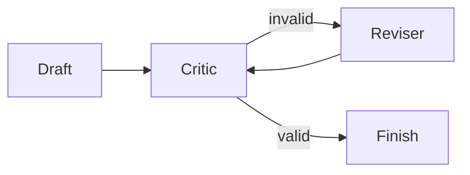

# Critic-reviser

## Purpose

Validate a draft and revise it within a fixed iteration limit.

## Architecture



## Run

```bash
uv run python patterns/critic_reviser/run.py
```

## Expected output

The unsupported draft is revised once and terminates after deterministic evidence validation succeeds.

## Concept introduced

Critique and revision form a cyclic execution pattern with an explicit stopping rule.

## Limitations

A critic may still accept plausible errors outside its deterministic checks.

## Next step

Separate work by task and permission in [orchestrator-worker](../orchestrator_worker/README.md).
