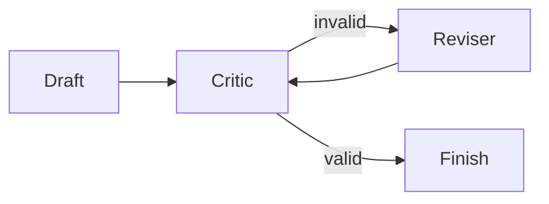

# Critic-reviser

Validate a draft and revise it within a fixed iteration limit.

Run: `uv run python patterns/critic_reviser/run.py`.

Use case: deterministic evidence checks. Limitation: a critic may still accept plausible errors.
