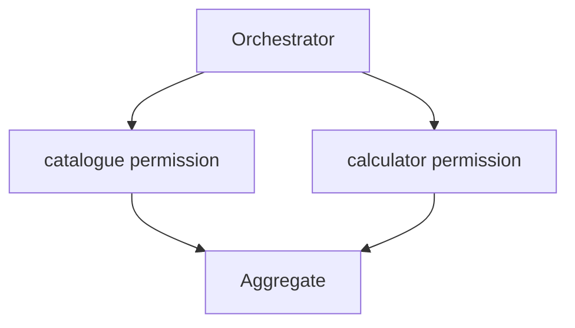

# Orchestrator-worker

Assign functionally different tasks to workers with distinct tool permissions.

Run: `uv run python patterns/orchestrator_worker/run.py`.

Use case: least-privilege specialisation. Limitation: coordination adds calls and failure paths.
