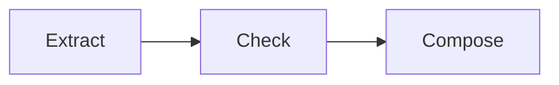

# Prompt chaining

## Purpose

Pass each bounded stage's structured result to the next stage.

## Architecture



## Run

```bash
uv run python patterns/prompt_chaining/run.py
```

## Expected output

The command prints the deterministic extract, check and composed artefacts in stage order.

## Concept introduced

Prompt chaining makes a linear execution pattern explicit while reusing the shared model contracts.

## Limitations

An early error propagates downstream unless a later stage detects it.

## Next step

Choose and combine branches in [routing and parallelisation](../routing_parallelisation/README.md).
