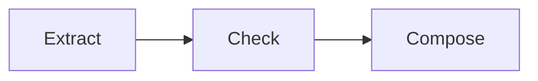

# Prompt chaining

Pass each bounded stage's structured result to the next stage.

Run: `uv run python patterns/prompt_chaining/run.py`.

Use case: staged evidence transformation. Limitation: an early error propagates downstream.
