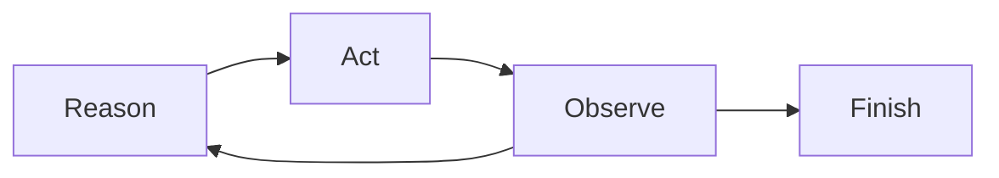

# ReAct-style tool use

## Purpose

Alternate an explicit operational reason, a canonical tool action and its observation.

## Architecture



## Run

```bash
uv run python patterns/react_tool_use/run.py
```

## Expected output

The deterministic trajectory contains one reason, one validated catalogue action, its observation and explicit termination.

## Concept introduced

The pattern interleaves model decisions with environmental feedback without exposing private chain-of-thought.

## Limitations

Repeated actions and cycles require the shared circuit breakers.

## Next step

Separate decomposition from action in [planner-executor](../planner_executor/README.md).
