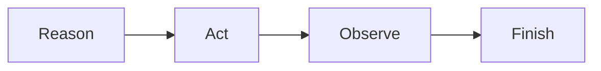

# ReAct-style tool use

Alternate an explicit operational reason, a canonical tool action and its observation.

Run: `uv run python patterns/react_tool_use/run.py`.

Use case: evidence lookup. Limitation: repeated actions require the shared circuit breaker.
