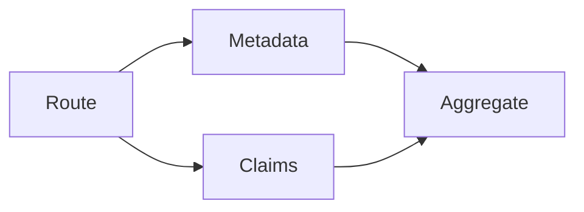

# Routing and parallelisation

## Purpose

Select a route, run independent workers concurrently and aggregate results in stable order.

## Architecture



## Run

```bash
uv run python patterns/routing_parallelisation/run.py
```

## Expected output

Metadata and claim results are aggregated deterministically regardless of completion order.

## Concept introduced

Routing selects a branch; parallelisation executes independent branches. They form one pattern group but remain distinct operations.

## Limitations

Incorrect routing selects inappropriate workers, and parallel work is unsafe when tasks share mutable state.

## Next step

Alternate decisions and environmental observations in [ReAct-style tool use](../react_tool_use/README.md).
