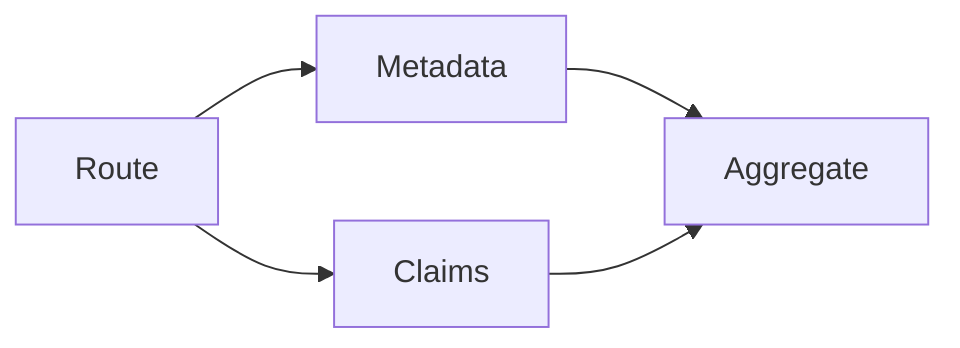

# Routing and parallelisation

Select a route, run independent workers concurrently, then aggregate in stable order.

Run: `uv run python patterns/routing_parallelisation/run.py`.

Use case: independent evidence checks. Limitation: incorrect routing selects inappropriate workers.
