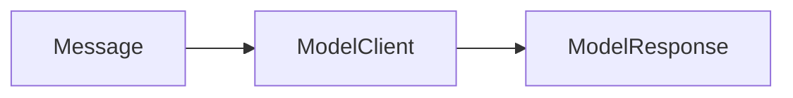

# Basic model invocation

## Purpose

Send one canonical request through the shared deterministic model interface.

## Architecture



## Run

```bash
uv run python tutorials/basic_model/run.py
```

## Expected output

`{"answer": "Paper paper-001 is relevant.", "concept": "model invocation"}`

## Concept introduced

The model client separates canonical messages and responses from any provider SDK. This is a system component, not an agent loop.

## Limitations

Tools, explicit state and iteration are deliberately excluded.

## Next step

Add validated environmental interaction in [tool use](../tool_use/README.md).
