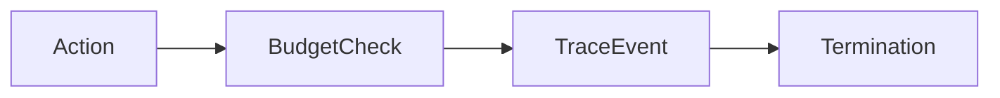

# Bounded execution and tracing

## Purpose

Add a finite shared budget and canonical run, budget and termination events.

## Architecture



## Run

```bash
uv run python tutorials/bounded_tracing/run.py
```

## Expected output

Canonical events are written beneath `outputs/runs/tutorial-bounded/` and can be normalised for deterministic comparison.

## Concept introduced

Budgets bound execution; traces record operational decisions without storing private chain-of-thought.

## Limitations

Framework-native observability and live-provider cost estimation are deliberately excluded.

## Next step

Apply state, checkpointing and permission at [human approval](../human_approval/README.md).
