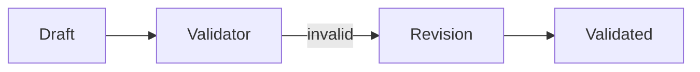

# Critique and validation

## Purpose

Validate a draft and perform one bounded correction of an unsupported identifier.

## Architecture



## Run

```bash
uv run python tutorials/critique_validation/run.py
```

## Expected output

The initial draft fails validation and the corrected draft cites `paper-001`.

## Concept introduced

Critique checks an artefact against explicit evidence; revision responds to that check under a stopping rule.

## Limitations

Open-ended model judging and unbounded revision are deliberately excluded.

## Next step

Make limits and operational events visible in [bounded execution and tracing](../bounded_tracing/README.md).
