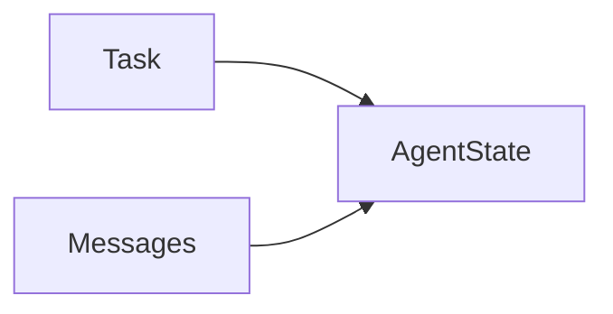

# Explicit state

## Purpose

Represent the task and messages in a serialisable canonical `AgentState`.

## Architecture



## Run

```bash
uv run python tutorials/explicit_state/run.py
```

## Expected output

The output reports one retained message in a schema-versioned state object.

## Concept introduced

State is the inspectable execution record. It is distinct from the subset of context sent to a model and from long-term memory.

## Limitations

Planning, persistence and memory retrieval are deliberately excluded.

## Next step

Decompose work explicitly in [planning](../planning/README.md).
