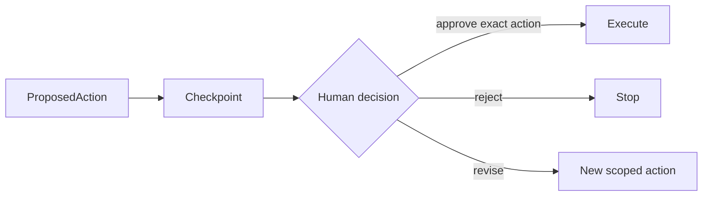

# Human approval and resumption

## Purpose

Pause before a simulated consequential action, persist it and resume only after an exact scoped decision.

## Architecture



## Run

Interactive demonstration:

```bash
uv run python tutorials/human_approval/run.py
```

Deterministic approval path:

```bash
uv run python -m agentic_tutorial.education approval --decision approve
```

Use `reject`, or `revise --revised-title "Checked revision"`, for the other deterministic paths.

## Expected output

The approve path executes the simulated action once. Reject never executes it. Checkpoints and human-decision events are written beneath `outputs/runs/approval-demo/`.

## Concept introduced

Human approval is an auditable permission boundary, not unrestricted conversational feedback.

## Limitations

All effects remain local and simulated; no external system is modified.

## Next step

Arrange the components into reusable [execution patterns](../../patterns/README.md).
