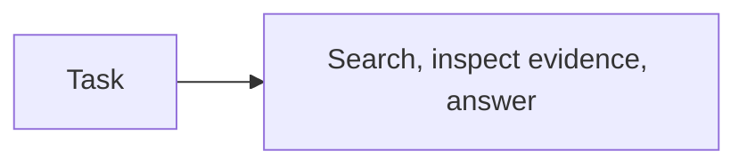

# Planning

## Purpose

Add an explicit finite decomposition to the stateful progression.

## Architecture



## Run

```bash
uv run python tutorials/planning/run.py
```

## Expected output

The plan contains three ordered steps: search, inspect evidence and write an answer.

## Concept introduced

Planning makes task decomposition explicit before execution.

## Limitations

Execution, replanning and multiple agents are deliberately excluded.

## Next step

Carry information between decisions in [retained context](../retained_context/README.md).
