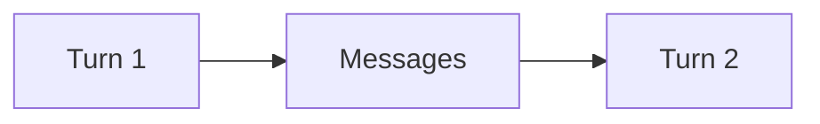

# Retained context

## Purpose

Retain canonical messages across turns without introducing a memory database.

## Architecture



## Run

```bash
uv run python tutorials/retained_context/run.py
```

## Expected output

The second turn can identify `paper-001` from retained messages.

## Concept introduced

Context is information supplied for a current decision. Retained context is not synonymous with durable or semantic memory.

## Limitations

Retrieval, vector storage and long-term memory policies are deliberately excluded.

## Next step

Check a draft deterministically in [critique and validation](../critique_validation/README.md).
