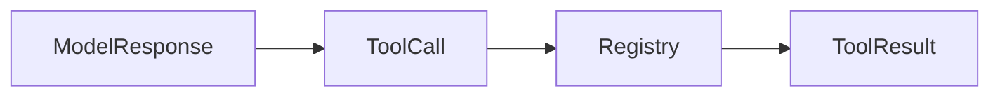

# Tool use

## Purpose

Add one validated, read-only catalogue call to the preceding model example.

## Architecture



## Run

```bash
uv run python tutorials/tool_use/run.py
```

## Expected output

The deterministic result contains only `paper-001` and reports a successful canonical tool result.

## Concept introduced

A tool is a permission-controlled interface to an environment. Its name and arguments are validated before execution.

## Limitations

Explicit state, iteration and side effects are deliberately excluded.

## Next step

Make execution inspectable in [explicit state](../explicit_state/README.md).
